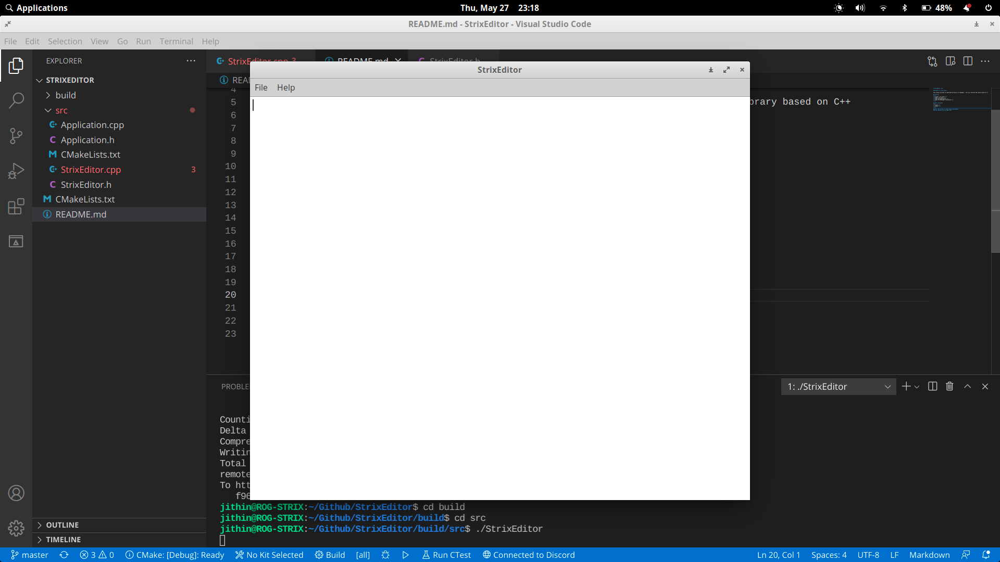
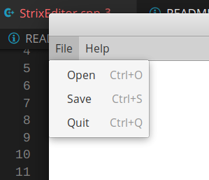
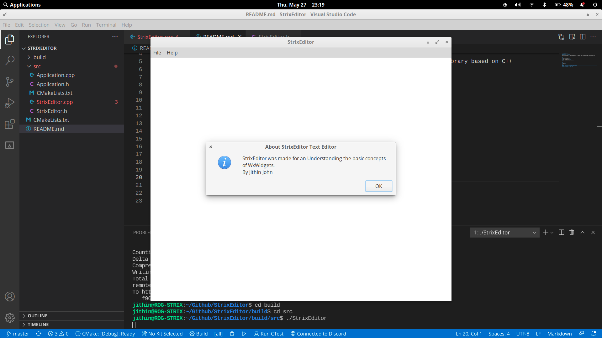
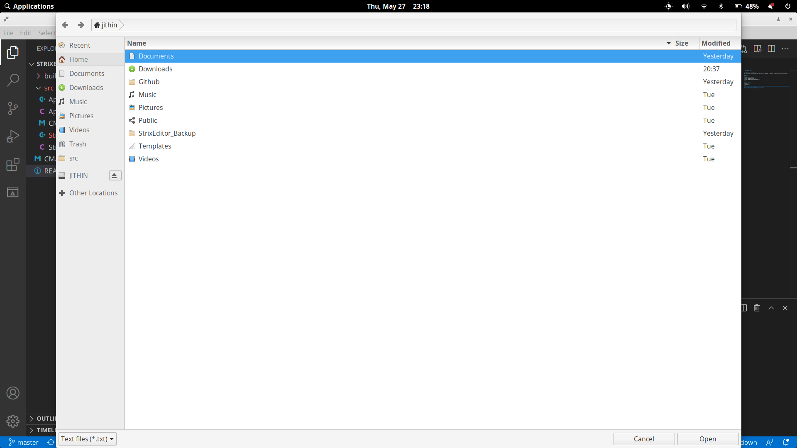

# StrixEditor :owl:

### Reason for the Project

This project was done to understand the basics of wxWidgets : The Cross Platform GUI Library based on C++

## Features
<ol>
<li>Create .txt files</li>
<li>Open .txt files</li>
<li>Exit the Application</li>
<li>Show the Developer Information</li>
<li>Export the written content as PDF, SVG or PostScript</li>
</ol>

## Menus Available
<ol>
<li>File</li>
<li>About</li>
<li>Export</li>
</ol>

## How does it look?
#### On Linux 5.4.0-73-generic Built on Ubuntu 18.04.4 LTS GTK 3.22.30
#### Main Application
 

 

#### Menu
 

 

#### About
 

 

#### Open File Box Appearance
 

 

### PS : The Project is under heavy developement
### New features will be added soon
